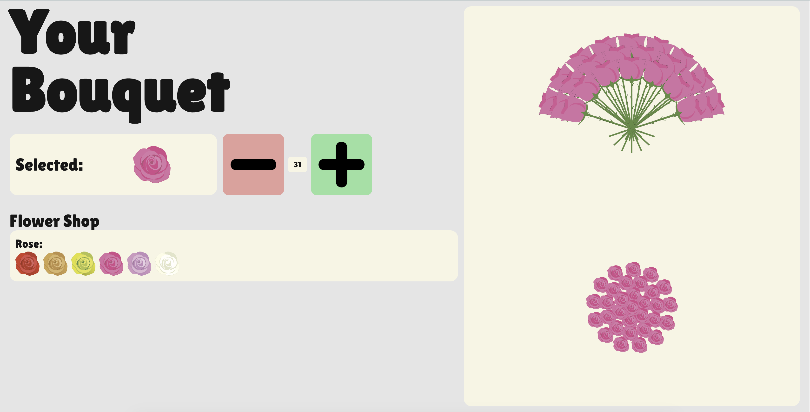

# Bouquet Builder

Bouquet Builder is an interactive web app for designing a flower bouquet in real time. Users can add or remove flowers, switch rose colors, and immediately see the bouquet update in both a top-down arrangement view and a side-profile presentation view.

This project is a good snapshot of product thinking plus frontend implementation: it combines a simple shopping-style interaction model with custom placement logic that keeps the bouquet visually organized as flowers are added.

Live link: [bouquet-builder-plum.vercel.app](https://bouquet-builder-plum.vercel.app/)



## What This Project Does

- Lets users build a bouquet by incrementally adding or removing flowers
- Updates the bouquet in real time in two synchronized perspectives:
  - top-down layout
  - side-profile layout
- Supports multiple rose color variants through reusable flower assets
- Uses a custom bouquet placement engine to calculate flower positioning instead of hardcoding layouts

## Why It Stands Out

Instead of rendering a static mockup, the app computes bouquet structure dynamically. As the flower count changes, the layout engine recalculates:

- circular spacing for the top-down bouquet view
- layered spacing and rotation for the side view
- flower ordering and positioning as the bouquet grows

That makes the project more than a UI exercise; it demonstrates state management, geometric layout logic, and interactive visual rendering in a React application.

## Tech Stack

- Next.js 15
- React 18
- TypeScript
- Zustand for client-side state management
- Tailwind CSS v4 for styling

## Current Scope

The current version focuses on roses, with multiple color options available. The architecture is set up so additional flower types can be added by introducing new assets and extending the flower source data.

## Project Structure

- `app/components/` contains the bouquet builder UI and the two bouquet display views
- `app/lib/bouquetCalculator.ts` contains the layout logic for positioning flowers
- `app/lib/store.ts` manages the selected flower and bouquet state with Zustand
- `public/rose/` stores the flower assets used in the rendered bouquet

## Running Locally

```bash
npm install
npm run dev
```

Then open [http://localhost:3000](http://localhost:3000).
